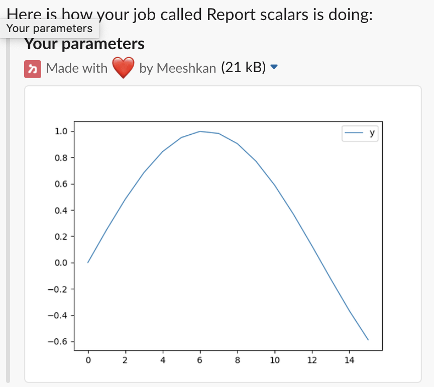
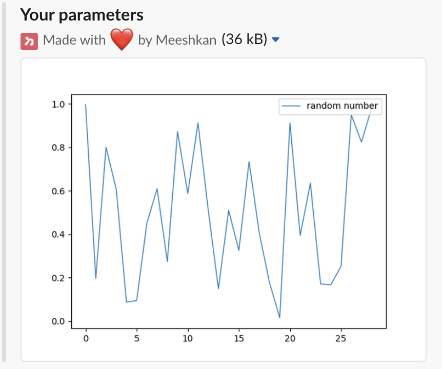

# Writing scripts using Meeshkan

This example assumes that you are familiar with the [command-line usage](../use-cli)
and you have Meeshkan agent running.

## Periodical notifications

Run the example script:
```bash
$ meeshkan submit --name "Report scalars" --report-interval 10 report_scalars.py
```

Note the option `--report-interval 10`: This means that you want to get notifications
of your job's progress every ten seconds (not a good idea for a long running job!).

You should have obtained a Slack notification containing a plot looking something like this:



The variable `y` here is defined via `meeshkan.report_scalar` as follows
in the submitted script:
```python
...
for i in range(ITERATIONS):
    meeshkan.report_scalar("y", math.sin(i * 2 * math.pi / ITERATIONS))
    ...
```
Values reported to `meeshkan` are the ones reported to you at fixed intervals (ten seconds in
above `meeshkan submit` command).

This toy example is reporting values of `y` from a sine curve. In you ML jobs, you would
want to report values such as `train_loss`, `train_accuracy`, `val_loss`, etc.

## Conditional notifications

Submit the example script using conditional notifications:
```bash
$ meeshkan submit --name "Conditional notifications" report_condition.py
```

The script looks as follows:
```python
meeshkan.add_condition("random number", condition=lambda number: number > RANDOM_NUMBER_THRESHOLD)
for i in range(ITERATIONS):
    new_random_number = random.uniform(0, 1)
    meeshkan.report_scalar("random number", new_random_number)
    ...
```
In the first line, a condition is added with `meeshkan.add_condition`:
a notification should be sent if scalar reported as `random_number` is larger
than `RANDOM_NUMBER_THRESHOLD`.

Inside the loop, a new random number is generated and reported to the agent.
If the value meets the condition set with `meeshkan.add_condition`, a notification will be
sent.

In my case, my last Slack notification looked like the following:



Now that you know how scalars are reported via Meeshkan, start adding them
into your machine learning jobs! If you want a real machine learning example,
check [this example](https://meeshkan-client.readthedocs.io/en/latest/#pytorch-example)
using PyTorch.
